# Beep Revival — the device UI

Everything the Beep tells you and everything you can tell it, without an app. Two
surfaces: the **24-LED ring** (status) + the **knob** (control), and a local
**web admin** for setup and settings.

---

## The knob (physical control)

The knob is a rotary encoder with a push-button, read by the STM8 companion MCU.

| Gesture | Action |
|---|---|
| **Turn** | Volume. Clockwise = up. One LED of the ring per detent; the arc fills from the bottom (6 o'clock) clockwise. Volume is shared — AirPlay, the web slider, and the knob all move the same level. |
| **Single tap** | **Mute / unmute** (soft-mute: saves the level, drops to 0, restores on the next tap). The ring shows a calm dim breath while muted. |
| **Double tap** | **Join the active multi-room group** (Snapcast). *Experimental — see multi-room note.* |
| **Hold ~10 s** | **Enter Wi-Fi setup.** The ring fills to full as you hold; release when full → the device raises its `BeepRevival-Setup-XXXXXX` AP. This is the *only* way to open setup on a configured device (deliberate physical action — it can't be forced by a deauth attack). |
| **Hold ~30 s** | **Factory reset** (wipes config + reboots). After the ring first fills (10 s), it empties and fills a **second** time on a brighter background — that second sweep is the reset countdown. Release before it completes if you didn't mean it. |

---

## The LED ring (status)

24 LEDs. No LED sits exactly on a clock cardinal — 12 o'clock straddles the top
two LEDs, 6 o'clock the bottom two.

The animations below are rendered from the actual on-device drawing code (see
`feed/beepd/src/beepd.c` and `rootfs-overlay/usr/libexec/beep/led-stage`), at the
device's real 24 Hz.

| State | Animation | What it means |
|---|---|---|
| **Boot** | 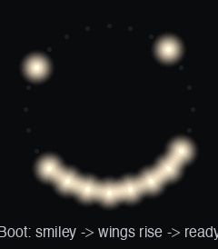 | A power-on smiley, then "wings" rise from the bottom (6 o'clock) up both sides as it boots, then a full ring as it hands off to live status. |
| **Wi-Fi connecting** | 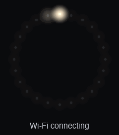 | A single bright dot orbiting a dim full track while joining Wi-Fi. |
| **Wi-Fi setup mode** | 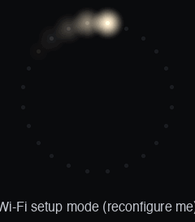 | A comet chasing around a dark ring — "reconfigure me" (setup AP is up). |
| **Idle** (connected, nothing playing) | 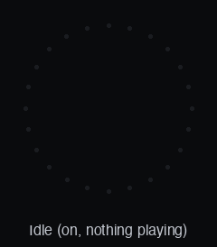 | Just the **bottom two LEDs** gently breathing — on, at rest. |
| **Sleep** (deep idle) | 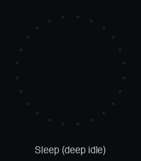 | The same bottom two dots, slower and dimmer, after a longer idle. |
| **Volume** (while turning) | 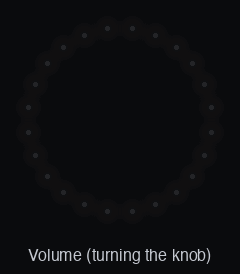 | A bright arc from the bottom, clockwise, over a dim full-scale track. 50% = the whole left side. |
| **Playing** (AirPlay) | 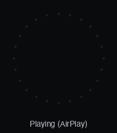 | A sparse, slow **twinkle** — random LEDs spark up and fade (a "something's playing" shimmer). |
| **Muted** | 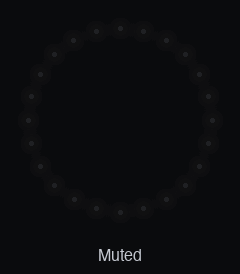 | A slow, dim whole-ring breath (clearly calmer than the playing twinkle). |
| **Button press** | 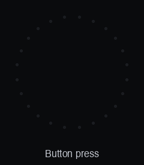 | A single whole-ring pulse (tactile feedback). |
| **Holding the knob** | 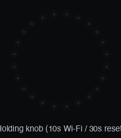 | A hold-progress meter: fills once at ~10 s (release → Wi-Fi setup), then empties and fills again on a brighter track to ~30 s (factory reset). |
| **Firmware update** (OTA) | 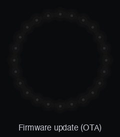 | The dial fills clockwise from 12 o'clock over the flash — don't power off. |
| **Failsafe / warning** | 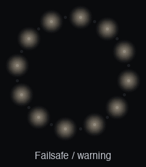 | Alternating LEDs blinking — the boot failsafe / a warning state. |

*(GIFs regenerated with `scripts/led-ui-gifs.py`.)*

---

## Web admin

Once the Beep is on your Wi-Fi, open **`http://<device-ip>/`** (also HTTPS on 443
with a self-signed cert). From there: rename it (renames AirPlay too), set volume,
change the admin password, toggle SSH (off by default), pick a multi-room role,
and apply **signed firmware updates**.

### First-time setup

A never-configured Beep raises a **`BeepRevival-Setup-XXXXXX`** Wi-Fi network (WPA2).
Join it and a captive portal pops up. If it doesn't, browse to
**`http://192.168.60.1`** — the Beep's fixed address on its own setup network.
Either way: pick your Wi-Fi and a name, done.

- **Device password / setup code** = **`C49300`** + the 6 characters at the end of
  the setup SSID. Example: `BeepRevival-Setup-A7F3E1` → **`C49300A7F3E1`**. It's the
  same code for the setup-AP Wi-Fi *and* the admin login.
- It's derivable from the broadcast SSID, so **change the admin password immediately**
  after setup (treat it as a factory default).

### Updating firmware (signed OTA)

Download the `*-sysupgrade.signed.bin` from the [Releases](../../releases) page and
upload it in the web admin's **Update firmware** panel. The device verifies the
`usign` signature against its baked-in public key before flashing — an unsigned
image is rejected unless you physically triple-tap to override.

---

## Multi-room (experimental)

Multi-room sync exists (one Beep = *primary*/source, others = *member*/sink) via two
engines: the default **Snapcast** path, and the custom **replaynet** engine
(`MULTIROOM=replaynet` builds; see `docs/REPLAYNET.md`). Both are **experimental** for
now on the 400 MHz AR9331:

- **Snapcast** is CPU-tight when the primary also receives AirPlay and serves the group
  during playback.
- **replaynet** plays across rooms, but on the wifi (member) path still has **audible
  dropouts and imperfect room-to-room sync** — the residual is heavy-tailed timing
  spikes on the loaded SoC (`~11 snap events / 25 s` on the tuned two-Beep tone harness;
  worse on real music). Root cause and the planned fix (a robust/median error filter,
  not PI / wider-clamp / debounce — all tried and rejected by ear) are tracked in
  `docs/REPLAYNET-WIFI-TUNING.md`.

Single-room AirPlay (**Solo**) is the solid, default path.
